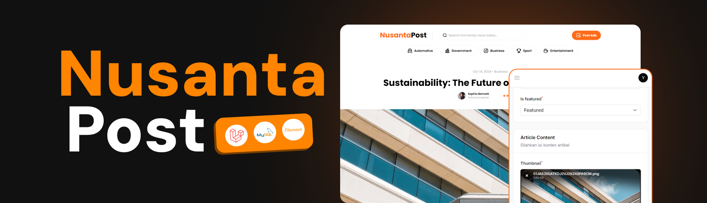

<a id="readme-top"></a>

[![Contributors][contributors-shield]][contributors-url]
[![Forks][forks-shield]][forks-url]
[![Stargazers][stars-shield]][stars-url]
[![Issues][issues-shield]][issues-url]
[![MIT License][license-shield]][license-url]
[![LinkedIn][linkedin-shield]][linkedin-url]


<!-- PROJECT LOGO -->
<br />
<div align="center">
  <a href="https://github.com/YogaDharma21/NusantaPost">
    
  </a>

  <h3 align="center">NusantaPost</h3>

  <p align="center">
    Your daily dose of news that you actually care
    <br />
    <a href="https://github.com/YogaDharma21/NusantaPost"><strong>Explore the docs »</strong></a>
    <br />
    <br />
    <a href="#">View Demo</a>
    ·
    <a href="https://github.com/YogaDharma21/NusantaPost/issues/new?labels=bug&template=bug-report---.md">Report Bug</a>
    ·
    <a href="https://github.com/YogaDharma21/NusantaPost/issues/new?labels=enhancement&template=feature-request---.md">Request Feature</a>
  </p>
</div>


<details>
  <summary>Table of Contents</summary>
  <ol>
    <li>
      <a href="#about-the-project">About The Project</a>
      <ul>
        <li><a href="#built-with">Built With</a></li>
      </ul>
    </li>
    <li>
      <a href="#getting-started">Getting Started</a>
      <ul>
        <li><a href="#prerequisites">Prerequisites</a></li>
        <li><a href="#installation">Installation</a></li>
      </ul>
    </li>
    <li><a href="#usage">Usage</a></li>
    <li><a href="#roadmap">Roadmap</a></li>
    <li><a href="#contributing">Contributing</a></li>
    <li><a href="#license">License</a></li>
    <li><a href="#contact">Contact</a></li>
  </ol>
</details>


<!-- ABOUT THE PROJECT -->
## About The Project

[![Product Name Screen Shot][product-screenshot]](#)
[![Filament Screenshot][filament-screenshot]](#)

NusantaPost is a web-based news application developed using Laravel MySql and Filament. Users are given an access to view news articles and are allowed to manage the content which is published a surge in its demand. NusantaPost provides guests with the latest news available in different sections, including, but not limited to, the ones pertaining to politics, technology, and sports to name just a few.

Through the use of Filament’s administration backend, admins can effectively control news articles, their categories, as well as their users. It eliminates the burden of management and administration of web content on the admin team since all processes in the creation of news articles can be done easily, quickly, accurately, and conveniently. Data backup and retrieval is made quick and reliable through theuse of MySQL Database making the app to be an upscalable one, which can manage a large load of traffic.

Some of them Key Features of NusantaPost are:
- Timeliness: Breaking news can be read in several categories as it unfolds.
-  Simplicity: Easy and adaptive design interface, suitable for use on computers and mobile devices as well.
- News Segment: Articles can be organized thematically to assist the reader.
- Searching and Making Queries: You can conduct detailed queries in order to obtain certain news items in particular.
- Management System: Backend based on Filament for simple administration of articles, users and other parameters.
- MySQL: Effective and quick news data management language for information storage and retrieval.

Nusantapost is a complete system for presenting news contents in an effective manner which is further enhanced by the robust Laravel development tools and the lightweight filament admin panel.

<p align="right">(<a href="#readme-top">back to top</a>)</p>


### Built With
* [![Laravel][Laravel.com]][Laravel-url]
* [![Mysql][Mysql.com]][Mysql-url]

<p align="right">(<a href="#readme-top">back to top</a>)</p>


<!-- GETTING STARTED -->
## Getting Started

This is an example of how you may give instructions on setting up your project locally.
To get a local copy up and running follow these simple example steps.

### Prerequisites
* Composer **2.4**
* PHP **8.3**

### Installation
1. Clone the repo
   ```sh
   git clone https://github.com/YogaDharma21/NusantaPost.git
   ```
2. Install needed laravel deppedencies
   ```sh
   composer install
   ```
3. Create a new .env from .env.example
   ```sh
   cp .env.example .env
   ```
4. Create a unique laravel key
   ```sh
   php artisan key:generate
   ```
5. Run The Project
   ```sh
   php artisan serve
   ```
6. Create a new filament user
   ```sh
   php artisan make:filament-user
   ```
<p align="right">(<a href="#readme-top">back to top</a>)</p>

<!-- ROADMAP -->
## Roadmap
- [x] Add filament
- [ ] Clean up components layout
- [ ] Add responsive design / website redesign

See the [open issues](https://github.com/YogaDharma21/NusantaPost/issues) for a full list of proposed features (and known issues).

<p align="right">(<a href="#readme-top">back to top</a>)</p>

<!-- LICENSE -->
## License
Distributed under the MIT License. See `LICENSE.txt` for more information.

<p align="right">(<a href="#readme-top">back to top</a>)</p>

<!-- CONTACT -->
## Contact
Yoga Dharma - yogadharmaputra2006@gmail.com

Project Link: [https://github.com/YogaDharma21/NusantaPost](https://github.com/YogaDharma21/NusantaPost)

<p align="right">(<a href="#readme-top">back to top</a>)</p>

<!-- RESOURCE -->
[contributors-shield]: https://img.shields.io/github/contributors/YogaDharma21/NusantaPost.svg?style=for-the-badge
[contributors-url]: https://github.com/YogaDharma21/NusantaPost/graphs/contributors
[forks-shield]: https://img.shields.io/github/forks/YogaDharma21/NusantaPost.svg?style=for-the-badge
[forks-url]: https://github.com/YogaDharma21/NusantaPost/network/members
[stars-shield]: https://img.shields.io/github/stars/YogaDharma21/NusantaPost.svg?style=for-the-badge
[stars-url]: https://github.com/YogaDharma21/NusantaPost/stargazers
[issues-shield]: https://img.shields.io/github/issues/YogaDharma21/NusantaPost.svg?style=for-the-badge
[issues-url]: https://github.com/YogaDharma21/NusantaPost/issues
[license-shield]: https://img.shields.io/github/license/YogaDharma21/NusantaPost.svg?style=for-the-badge
[license-url]: https://github.com/YogaDharma21/NusantaPost/blob/master/LICENSE.txt
[linkedin-shield]: https://img.shields.io/badge/-LinkedIn-black.svg?style=for-the-badge&logo=linkedin&colorB=555
[linkedin-url]: https://www.linkedin.com/in/ida-bagus-yoga-dharma-putra/
[product-screenshot]: docs/screenshot.png
[filament-screenshot]: docs/filament.png
[Laravel.com]: https://img.shields.io/badge/Laravel-FF2D20?style=for-the-badge&logo=laravel&logoColor=white
[Laravel-url]: https://laravel.com
[Mysql.com]: https://img.shields.io/badge/mysql-4479A1.svg?style=for-the-badge&logo=mysql&logoColor=white
[Mysql-url]: https://www.mysql.com/

